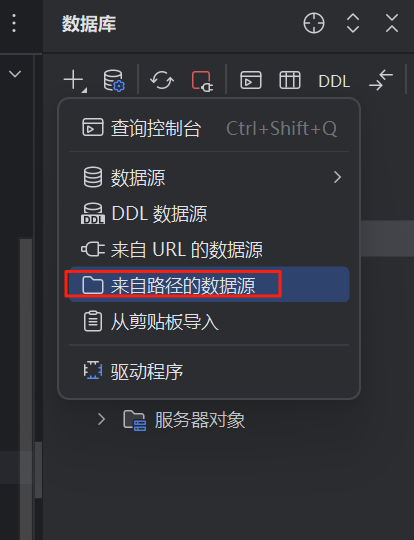

# 博客 API 系统（Gin + GORM + SQLLITE + JWT）

## 🧰 技术栈

- Go 1.21+
- Gin Web 框架
- GORM ORM
- SQLLITE 数据库
- JWT 认证
- Zap 日志库

## 📦 运行环境要求

- Go 1.21+
- APIPOST（用于测试）

## 🔧 依赖安装

##  🛠️ 数据库配置
根目录下的blog.db文件存放数据库文件


##  🛠 其他配置
根目录下的.env文件存储jwt的密钥

## ▶️ 启动服务
go run main.go
```bash

##  🛠️ 数据库配置
go mod tidy